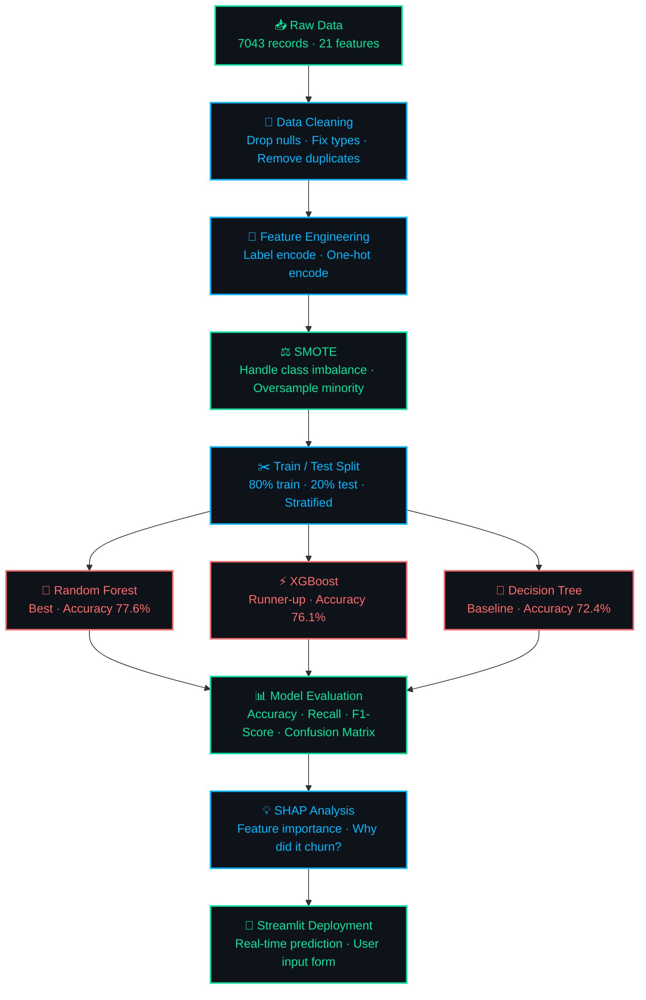

# 📡 Customer Churn Prediction App

> A machine learning web app that predicts whether a telecom customer will churn, built with Random Forest and deployed on Streamlit.

[](https://customer-churn-prediction-nd8rmh25com2szccvg7lnq.streamlit.app/)
[](https://python.org)
[](https://streamlit.io)
[](https://scikit-learn.org)

---

## 📌 What This Project Does

- Analyzes **7,043 telecom customer records** from IBM's Telco dataset
- Compares **Decision Tree**, **Random Forest**, and **XGBoost** models
- Deploys a **real-time prediction app** — enter customer details and get an instant churn prediction
- Uses **SMOTE** to handle class imbalance and **SHAP** for model explainability

---

## 🚀 Live Demo

👉 **[Click here to open the app](https://customer-churn-prediction-nd8rmh25com2szccvg7lnq.streamlit.app/)**

---

## 🔄 ML Pipeline



---

## 🧠 Best Model — Random Forest

| Metric | Score |
|---|---|
| ✅ Accuracy | **77.6%** |
| 🔁 Recall (Churn) | **70%** |
| 🎯 F1-Score (Churn) | **62%** |

---

## 📊 Top Churn Factors

| # | Feature | Impact |
|---|---|---|
| 1 | Contract Type | 🔴 Highest |
| 2 | Online Security | 🟠 High |
| 3 | Tenure | 🟠 High |
| 4 | Tech Support | 🟠 High |
| 5 | Monthly Charges | 🟡 Medium |

---

## 🔬 Model Comparison

| Model | Accuracy | Recall (Churn) | F1 (Churn) |
|---|---|---|---|
| ✦ **Random Forest** | **77.6%** | **70%** | **62%** |
| XGBoost | 76.1% | 68% | 60% |
| Decision Tree | 72.4% | 63% | 57% |

---

## 🛠️ Tech Stack

| Tool | Purpose |
|---|---|
| Python, Pandas, NumPy | Data processing |
| Scikit-learn | ML modeling |
| XGBoost | Gradient boosting |
| SHAP | Model explainability |
| SMOTE | Class imbalance handling |
| Streamlit | Web deployment |

---

## ▶️ Run Locally

```bash
# 1. Clone the repo
git clone https://github.com/your-username/customer-churn-prediction
cd customer-churn-prediction

# 2. Install dependencies
pip install -r requirements.txt

# 3. Launch the app
streamlit run app.py
```

---

## 📁 Dataset

[IBM Telco Customer Churn — Kaggle](https://www.kaggle.com/datasets/blastchar/telco-customer-churn)
